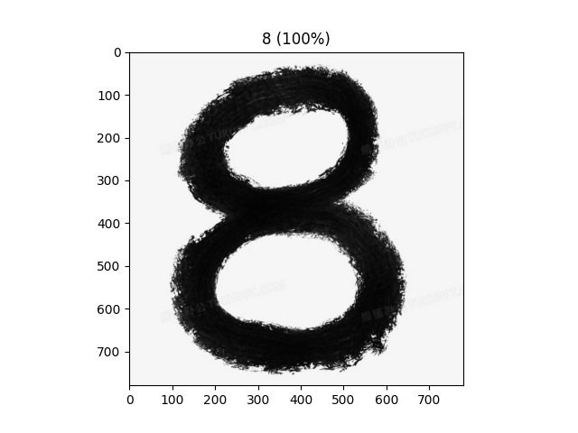

<h1 align = "center">使用Pytorch实现LeNet5网络</h1>
<h2 align = "center">在MNIST上进行手写数字识别</h2>


目录

[TOC]

<div style="page-break-after: always;"></div>

# 一、关于LeNet5

## 1.1 LeNet5简介

LeNet5网络是由CNN之父*Yann LeCun*在1998年提出的卷积神经网络，设计之初被用作邮电局手写数字和打印数字的识别。LeNet5凭借其简单明了的网络架构迅速流行，后来成为CNN研究的基石。

## 1.2 LeNet5网络结构

LeNet5有五层网络结构，因此得名LeNet5。


* 输入图像是单通道灰度图，大小为32*32

* 卷积层1：使用5*5的卷积核在输入图像上进行卷积操作，得到28\*28\*6的特征图1

* 下采样(池化)：使用一个2*2的avgPooling(平均池化)对特征图1进行下采样，得到14\*14\*6的特征图2

* 卷积层2：使用5*5的卷积核在特征图2上进行卷积，得到10\*10\*16的特征图3

* 下采样(池化)：使用一个2*2的avgPooling(平均池化)对特征图3进行下采样，得到5\*5\*16的特征图4

* 卷积层3：使用120个5*5的卷积核在特征图4上卷积，这时我们得到的将是一个1\*1\*120的向量

* 全连接层1：120->84的线性全连接

* 全连接层2：84->10的线性全连接。

前三个卷积层，可以理解为是特征提取器(**Feature Extractor**),后两个全连接层，可以理解为是分类器(**Classifier**)。

细节以及每一层的激活函数如下：

|   Layer    | filters/neurons | KernelSize | Stride | FeatureMapSize | Activation Function |
| :--------: | :-------------: | :--------: | :----: | :------------: | :-----------------: |
|   input    |        /        |     /      |   /    |    32x32x1     |          /          |
|   Conv1    |        6        |    5*5     |   1    |    28x28x6     |        tanh         |
| AvgPooling |        /        |    2*2     |   2    |    14x14x6     |          /          |
|   Conv2    |       16        |    5*5     |   1    |    10x10x16    |        tanh         |
| AvgPooling |        /        |    2*2     |   2    |     5x5x16     |          /          |
|   Conv3    |       120       |    5*5     |   1    |      120       |        tanh         |
|    fc1     |        /        |     /      |   /    |       84       |        tanh         |
|    fc2     |        /        |     /      |   /    |       10       |       Softmax       |

<div style="page-break-after: always;"></div>

# 二、具体实现

## 2.1 使用Pytorch搭建网络结构

```python
class LeNet5(nn.Module):

    def __init__(self, n_classes):
        super(LeNet5, self).__init__()

        self.feature_extractor = nn.Sequential(
            nn.Conv2d(in_channels=1, out_channels=6, kernel_size=5),
            nn.Tanh(),
            nn.AvgPool2d(kernel_size=2),
            nn.Conv2d(in_channels=6, out_channels=16, kernel_size=5),
            nn.Tanh(),
            nn.AvgPool2d(kernel_size=2),
            nn.Conv2d(in_channels=16, out_channels=120, kernel_size=5),
            nn.Tanh()
        )

        self.classifier = nn.Sequential(
            nn.Linear(in_features=120, out_features=84),
            nn.Tanh(),
            nn.Linear(in_features=84, out_features=n_classes),
        )

    def forward(self, x):
        x = self.feature_extractor(x)
        x = torch.flatten(x, 1)  # 1*1*120展平为向量
        output = self.classifier(x)  # 输出
        probs = F.softmax(output, dim=1)  # 每一类别的概率
        return output, probs
```

---

## 2.2 载入MNIST数据集

### 2.2.1 预处理

由于MNIST数据集的原始大小为28\*28，而LeNet5的输入尺寸为32\*32，因此在读取数据的时候要先做一步resize处理，将图片缩放，这里使用pytorch中的transforms来转换格式。

同时，由于raw数据差异较大并且数值通常都很大，因此tanh求导得到的导数可能接近于0，可能造成梯度丢失。为了解决这一问题，最好使用既有的均值和方差，将每个数据样本进行标准化，使得数据最后呈现均值为0方差为1的分布。MNIST官方提供的均值和标准差分别为$\mu=0.1307,\sigma=0.3081$

```python
transforms = transforms.Compose([transforms.Resize((32, 32)),transforms.ToTensor()， transforms.Normalize((0.1307,),(0.3081,))])
```

### 2.2.2 下载数据集

```Python
train_dataset = datasets.MNIST(root='data',
                               train=True,
                               transform=transforms,
                               download=True)

valid_dataset = datasets.MNIST(root='data',
                               train=False,
                               transform=transforms)
```

### 2.2.3 形成数据流

数据集中的图片并不是依次一张一张输入的，而是成批(batch)地输入，因此需要创建一个数据流:

```python
train_loader = DataLoader(dataset=train_dataset,
                          batch_size=BATCH_SIZE,
                          shuffle=True)

valid_loader = DataLoader(dataset=valid_dataset,
                          batch_size=BATCH_SIZE,
                          shuffle=False)
```

这里我取*BATCH_SIZE*=64，意思是每64张图片打包到一起，输入到模型中。

---

## 2.3 定义单次训练过程

```python
def train(train_loader, model, loss_func, optimizer, device):
    """
    定义单次训练过程

    :param train_loader:训练数据流
    :param model:网络模型
    :param loss_func:损失函数
    :param optimizer:优化器
    :param device:使用GPU or CPU
    :return:模型状态，优化器状态，本次训练损失
    """

    model.train()  # 切换训练模式
    running_loss = 0

    for imgs, labels in train_loader:
        optimizer.zero_grad()  # 优化器梯度初始化

        imgs = imgs.to(device)
        labels = labels.to(device)

        # 前向传播
        output, prob = model(imgs)
        loss = loss_func(output, labels)  # 计算损失
        running_loss += loss.item() * imgs.size(0)

        # 反向传播
        loss.backward()
        optimizer.step()

    epoch_loss = running_loss / len(train_loader.dataset)
    return model, optimizer, epoch_loss
```

其中:

```python
LEARNING_RATE=0.001
optimizer = torch.optim.Adam(model.parameters(), lr=LEARNING_RATE)
criterion = nn.CrossEntropyLoss()
```

优化器采用Adam算法，Adam算法集成了SGD的一阶Momentum和RMSProp的二阶Momentum，能够有效地避免梯度下降时剧烈震荡无法收敛，同时能加快梯度下降的速度。

m_t为t时刻的下降量，g_t为t时刻梯度方向。
$$
\begin{align}
m_t&=\beta _1m_{t-1}+(1-\beta _1)g_t\\
V_t&=\beta _2V_{t-1}+(1-\beta _2)g_t^2\\
where\\
V_t&=\sum _{\tau=1} ^t g_\tau ^2
\\

\end{align}
$$
损失函数使用交叉熵函数,
$$
L=-\frac 1N \sum _i ^N\sum _c  ^My_{ci}ln(p_{ci})\\
y_{ci}=\begin {cases} 0&样本i类别!=c \\
1&样本i类别=c 
\end{cases}
$$

---

## 2.4 定义单次验证过程

```Python
def validate(valid_loader, model, loss_func, device):
    """

    :param valid_loader:验证集数据流
    :param model:网络模型
    :param loss_func:损失函数
    :param device:GPU or CPU
    :return:模型状态，本次验证损失
    """

    model.eval()  # 设置为验证模式
    running_loss = 0

    for imgs, labels in valid_loader:
        imgs = imgs.to(device)
        labels = labels.to(device)

        # Forward pass and record loss
        output, prob = model(imgs)
        loss = loss_func(output, labels)
        running_loss += loss.item() * imgs.size(0)

    epoch_loss = running_loss / len(valid_loader.dataset)

    return model, epoch_loss
```

## 2.5 完整训练过程

```python
def training_process(model, loss_func, optimizer, train_loader, valid_loader, epochs, device):
    """
    完整训练过程
    :param model:网络模型
    :param loss_func:损失函数
    :param optimizer:优化器
    :param train_loader:训练集数据流
    :param valid_loader:验证集数据流
    :param epochs:训练次数
    :param device:GPU or CPU
    :param print_every:每隔多少次训练打印
    :return:模型状态，优化器,(训练损失，验证损失)
    """
    # 记录最佳结果
    best_loss = 1e10
    train_losses = []
    valid_losses = []
    for epoch in range(0, epochs):
        # 训练
        model, optimizer, train_loss = train(train_loader, model, loss_func, optimizer, device)
        train_losses.append(train_loss)
        if train_loss < best_loss:
            best_loss = train_loss
            best_epoch=epoch
            best_model=model
        # 验证
        with torch.no_grad():
            model, valid_loss = validate(valid_loader, model, loss_func, device)
            valid_losses.append(valid_loss)

        # 在验证集上计算准确度
        valid_acc = get_accuracy(model, valid_loader, device=device)
        print("Epoch:%d    TrainLoss=%.4f    ValidLoss=%.4f    ValidAccuracy=%.2f%%"%(epoch,train_loss,valid_loss,valid_acc*100))
    # 绘制loss曲线
    print("******Best Loss is in Epoch%d = %.4f******"%(best_epoch,best_loss))
    plot_losses(train_losses, valid_losses)
	#  记录最佳model
    return best_model, optimizer, (train_losses, valid_losses)
```

此处取Epochs=30,最后保存最佳的模型

```python
model, optimizer, _ = training_process(model, criterion, optimizer, train_loader, valid_loader, N_EPOCHS, DEVICE)
torch.save(model,"Model/LeNet5.pth")
```

<div style="page-break-after: always;"></div>

# 三、实验结果

## 3.1 训练输出


整个模型在验证集上的预测准确度达到了98.80%，数值上来说非常出色。

<center class="half">
    
    
</center>

可以看出，对于30个Epoch，验证损失已经接近于稳定，并开始逐渐呈现上升的态势，因此30个Epoch对于这个模型来说已经足够了。

## 3.2 测试

### 3.2.1在MNIST上的测试

使用``predict.py``中的``multi_predict()``函数随机从MNIST的验证集抽取50张进行测试：


### 3.2.2自己随机手写测试

使用``predict.py``中编写的``single_predict()``函数，传入图片路径，输出检测结果。

<center class="half">
    
    
    
</center>

效果非常不错。

<div style="page-break-after: always;"></div>

# 四、实验体会

## 体会

学习使用了pytorch的基本操作，学会了使用pytorch搭建一个经典的网络框架，加深了对深度学习神经网络中一些术语的理解，锻炼了代码能力。

## 不足

* 最开始使用自己手写的数字进行识别时，无论怎么测试也无法得到正确结果，几乎总是被预测为"8"。后来发现是训练用的数据是黑底白字，而自己写的数字是白底黑字，恍然大悟，在识别自己的数字时，要对灰度图进行反相，才能得到正确的结果。

  基于此问题，可以推断出此模型存在的不足：训练集样本过于理想化，总是黑白分明，而现实拍摄的照片不一定是黑底白字，底色可以是任何颜色，数字也是任何颜色，需要人事先去调整把图像灰度图转换为黑底白字的，比较麻烦。

* 训练数据集用到的数字都是正体的，没有经过旋转，因此对于现实中旋转的数据效果并不好。因此可以考虑在训练支出就进行数据增广，对源数据集进行一系列旋转拉伸的操作，丰富数据集，提高鲁棒性。

